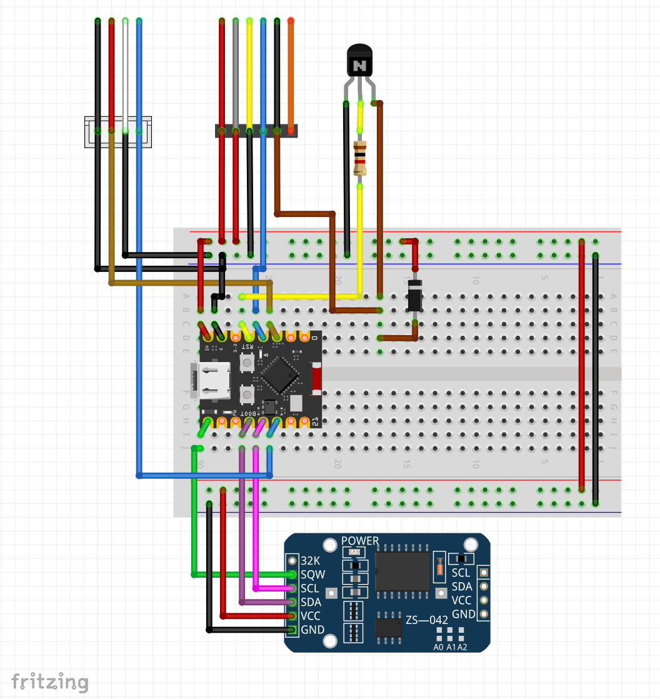
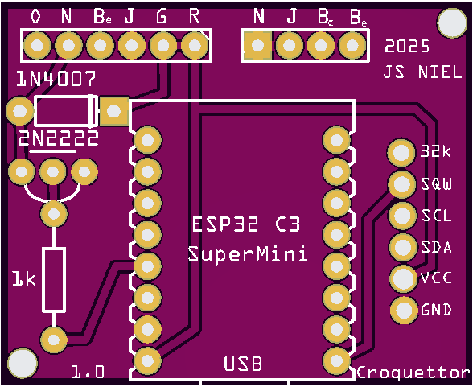
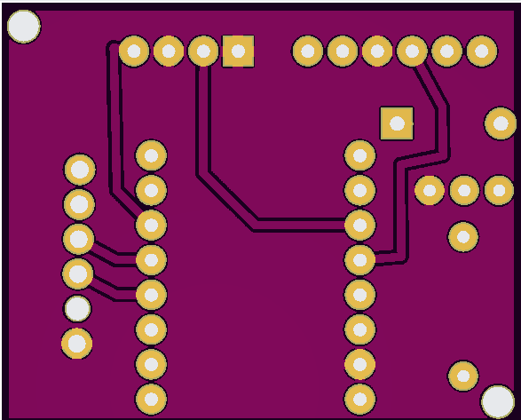
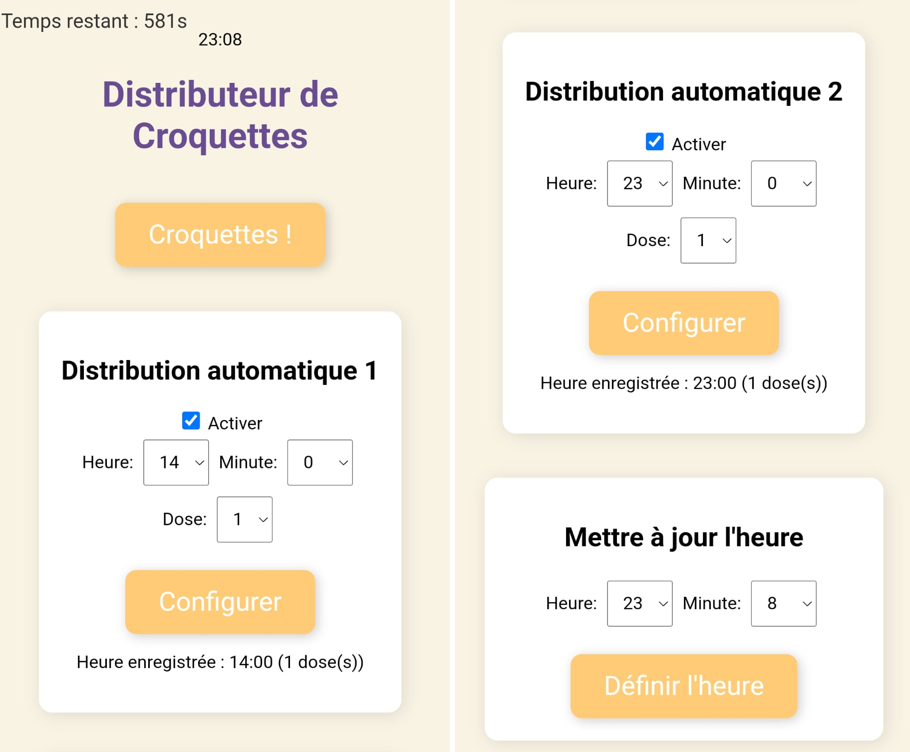

# 🐾 Croquettor

Open-source firmware to replace the original motherboard of an automatic cat feeder using an ESP32-C3 mini.

---

## 📌 Description

Croquettor allows you to upgrade a commercial automatic cat feeder by replacing its original electronics with a simple, open and fully customizable solution.

The firmware runs on an **ESP32-C3 Mini** and uses a **RTC (DS3231)** for reliable scheduling without cloud dependency.

---

## ⚠️ Disclaimer

This project is **not affiliated with any manufacturer**.

Tested with:
- Balimo Automatic Cat Feeder (2.4G WiFi)

---

## 🧩 Features

- ⏱️ Scheduled feeding (RTC based)
- 📶 WiFi configuration via web interface
- 🐱 Manual feeding (button or web)
- 🔧 Fully hackable firmware
- 🔌 No cloud required

---

## 🧰 Hardware

### Required

- ESP32-C3 Mini  
- RTC module (DS3231)

### Important

All other components (motor, endstop, mechanics, power) are part of the original feeder and reused.

---

## 🖼️ Project Images

### 🧪 Breadboard (Fritzing)


<p align="center">
  
</p>


### 🧾 PCB

<p align="center">
  
  
</p>

---

### Web interface

You can:
- Trigger feeding manually
- Set time (RTC)
- Configure 2 automatic schedules

<p align="center">
  
</p>

---

## 🚀 Firmware

Location:
```
firmware/croquettorFW.ino
```

---

## 🛠️ Arduino IDE Setup (ESP32-C3)

### 1. Add ESP32 boards

Open Arduino IDE:

- Go to **File → Preferences**
- In **Additional Boards Manager URLs**, add:

```
https://dl.espressif.com/dl/package_esp32_index.json

```

---

### 2. Install ESP32 package

- Go to **Tools → Board → Boards Manager**
- Search: `esp32`
- Install **"esp32 by Espressif Systems"**

---

### 3. Select board

- Tools → Board → ESP32 Arduino
- Select:

```
ESP32C3 Dev Module
```

---

### 4. Configure (recommended)

```
Flash Size: 4MB
Upload Speed: 115200
```

---

## ⚙️ Usage

### First boot

- Power the device
- Press and hold the button (~3s) to enable WiFi

### Connect

- SSID: `croquettor`
- Password: `12345678`

Open in browser:
```
http://192.168.4.1
```

---


## ⚠️ Known Issues

- No motor timeout protection (risk of blocking if endstop fails)
- No authentication on web interface

---

## 🧾 BOM

- ESP32-C3 Super Mini
- DS3231 RTC module

---

## 📂 Project Structure

```
croquettor/
├── firmware/
├── hardware/
├── images/
├── README.md
└── LICENSE
```

---

## 👤 Author

**jsniel**  
GitHub: https://github.com/jsniel

---

## 📜 License

This project is licensed under the MIT License.

This includes:
- Firmware
- Hardware design files (PCB, Gerber, Fritzing)

---

## 🤝 Contributing

Pull requests welcome.
